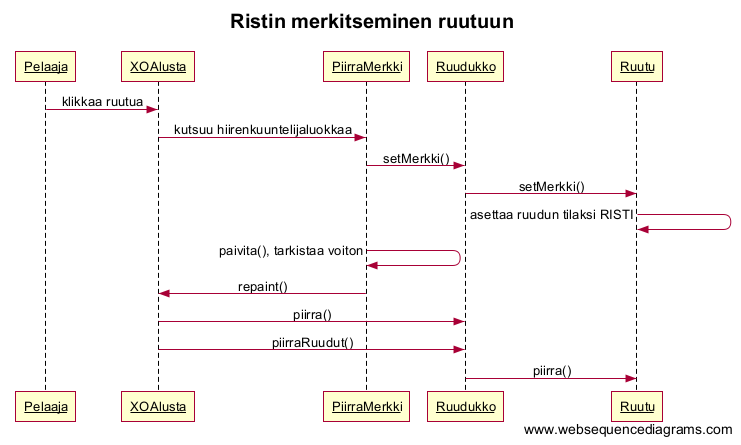
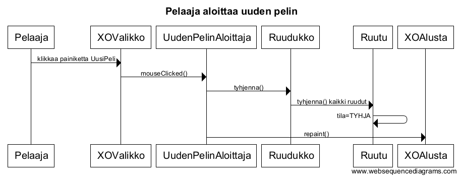

## Aiheen kuvaus ja rakenne

**Aihe:** Ristinolla. 

Toteutetaan siis Ristinolla-peli. 

Peli‰ pelataan 3x3 -kokoisella ruudukolla. Tavoitteena on saada kolme risti‰ tai ympyr‰‰ samalle pysty-, vaaka- tai vinoriville 3x3 -kokoisessa ruudukossa.

**K‰ytt‰j‰t:** 

- Pelaaja

**K‰ytt‰j‰n toiminnot:**

(- Valitsee pelattavan pelin: pieni / suuri ruudukko)
- Merkitsee ristin / ympyr‰n haluamaansa ruutuun
- Aloittaa uuden pelin

**Luokkakaavio:**

**Sekvenssikaaviot**

**Rakennekuvaus**

Peli koostuu kahdesta logiikkaluokasta, Ruutu ja Ruudukko, kahdesta enum -tyyppisest‰ luokasta, PelinTila ja Merkki, ja Koordinaatit-luokasta.
Ruudukko on kaksiulotteinen taulukko ja se koostuu Ruutu-olioista. Ruudulla on koordinaatit ja Merkki-enumluokan avulla m‰‰ritelt‰v‰ tila, eli se sijaitsee tietyss‰ kohtaa ruudukkoa ja sen tila voi olla 
risti, nolla tai tyhj‰. PelinTila -enumluokan avulla voi m‰‰ritt‰‰, onko peli kesken vai p‰‰ttyikˆ peli jomman kumman merkin voittoon tai tasapeliin.

