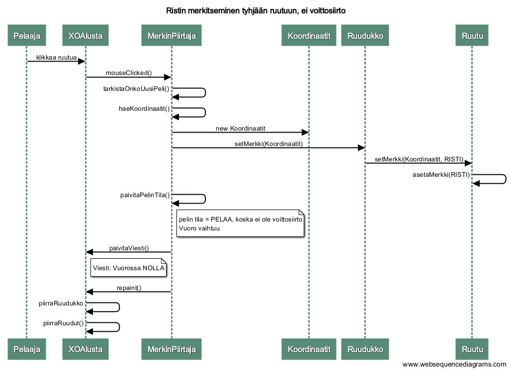

## Aiheen kuvaus ja rakenne

**Aihe:** Ristinolla. 

Toteutetaan Ristinolla-peli. 

Peliä pelataan 3x3 -kokoisella ruudukolla. Tavoitteena on saada kolme ristiä tai ympyrää samalle pysty-, vaaka- tai vinoriville 3x3 -kokoisessa ruudukossa.

**Käyttäjät:** 

- Pelaaja

**Käyttäjän toiminnot:**

- Merkitsee ristin / ympyrän haluamaansa ruutuun
- Aloittaa uuden pelin

**Luokkakaavio:**

**Sekvenssikaaviot**

**Rakennekuvaus**

Peli koostuu kahdesta logiikkaluokasta, Ruutu ja Ruudukko, kahdesta enum -tyyppisestä luokasta, PelinTila ja Merkki, ja Koordinaatit-luokasta.
Ruudukko on kaksiulotteinen taulukko ja se koostuu Ruutu-olioista. Ruudulla on koordinaatit ja Merkki-enumluokan avulla määriteltävä tila, eli se sijaitsee tietyssä kohtaa ruudukkoa ja sen tila voi olla 
risti, nolla tai tyhjä. PelinTila -enumluokan avulla voi määrittää, onko peli kesken vai päättyikö peli jomman kumman merkin voittoon tai tasapeliin.

Pelin käyttöliittymä koostuu XOIkkuna-luokasta, joka sisältää pelialustan (XOAlusta) ja valikon (XOValikko). Pelialustalle piirtyy koko peli.
Alustaan liittyy myös pelaajalle välittyvä viesti pelin tilasta ja vuoroista. 
Pelialustaan liittyy myös MouseListener-rajapinnan toteuttava MerkinPiirtaja, joka käsittelee hiiren klikkauksen ruudukossa.
Valikkoon liittyvät hiiren klikkauksen käsittelevät luokat UudenPelinAloittaja ja PelinSulkija. UudenPelinAloittaja aloittaa nimensä mukaisesti uuden pelin ja PelinSulkija taas lopettaa pelin ja sulkee ikkunan.

